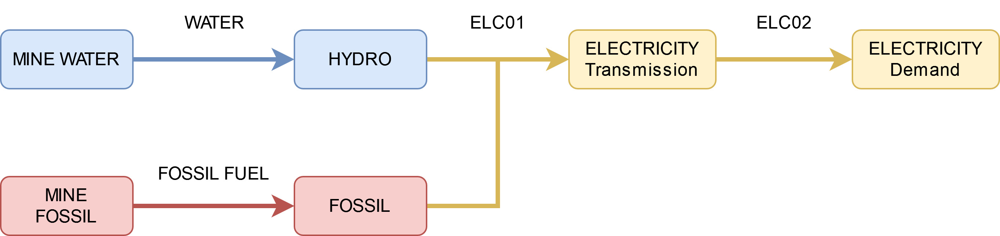
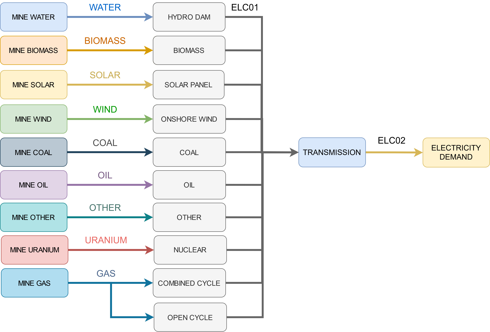

# Supplementary Material for GSA Paper

This folder contains all information needed to reproduce results in the GSA paper 
submitted to [Open Research Europe](https://open-research-europe.ec.europa.eu/). 

## Summary

The files and folders in this directory are summarised in the table below. 
More information on each item can be found in the following sections. 

| Folder Name      | Description                          |
|------------------|--------------------------------------|
| requirements.txt | pip version requirements             |
| Figures          | Figures presented in the Methods     |
| Model One        | Data and results relating to Model 1 |
| Model Two        | Data and results relating to Model 2 |
| Model Two        | Data and results relating to Model 3 |

### Notes

1. Only the summary results from the GSA results are included. Since the GSA will generate a large amount of data, to view the complete suite of GSA results is left up to the user through running the workflow with the supplied data. 

2. A copy of the OSeMOSYS model is included in each directory for consistency only. 
All three models use the same version of OSeMOSYS.

3. Each model has a `datapackage.json` and `config.yaml` file included in its
input data. These are consistent throughout the models and is used for data 
processing with [otoole](https://otoole.readthedocs.io/)

## Figures/

This folder containes author created graphics presented in the paper, such as the 
flowcharts and reference energy system diagrams. Moreover, the file `Diagrams.drawio.xml` 
is included, which can be imported to [diagrams.net](https://www.diagrams.net/)
to view the source of these graphics. 

## Model_One/ 

Model one is a single technology OSeMOSYS model, as shown below.

### Model/

Contains the OSeMOSYS model, and model inputs and outputs as CSVs. This data 
is used to generate capacity exapnsion result figures. 

### Images/ 

Images relating to model 1. These incldue capacity expansion result figures and GSA 
figures

### GSA/No_Demand/

GSA configuration files required to run Model 1 **without**  the Specified Annual 
Demand as a sensitivity parameter. Method of Morris results, generated by SALib, are 
stored in this folder.  

### GSA/With_Demand/

GSA configuration files required to run Model 1 **with**  the Specified Annual 
Demand as a sensitivity parameter. Method of Morris results, generated by SALib, are 
stored in this folder.  

### model_one.ipynb

Jupyter Notebook to generate all images shown in the `Images/` directory

## Model_Two/

Model two is a multi-technology OSeMOSYS model, as shown below.

### Model/

Contains the OSeMOSYS model, and model inputs and outputs as CSVs. This data 
is used to generate capacity exapnsion result figures. 
Two sets of model data are stored in this folder, one which 
does not have a ModelPeriodEmissionLimit, and one that does. All other data between 
these models are the same.

### Images/ 

Images relating to model 2. These incldue capacity expansion result figures and GSA 
figures

### GSA/No_Emission_Limit/

GSA configuration files required to run Model 2 **without** the Emission Limit. 
Method of Morris results, generated by SALib, are stored in this folder.  

### GSA/With_Demand/

GSA configuration files required to run Model 2 **with**  the Emission Limit. 
Method of Morris results, generated by SALib, are stored in this folder.  

### model_two.ipynb

Jupyter Notebook that generates all images shown in the `Images/` directory

## Model_Three/

Model three is a multi-technology OSeMOSYS model of Nepal, generated by 
[OSeMOSYS Global](https://osemosys-global.readthedocs.io). An overview of the 
energy system is shown below.

### Model/

Contains the OSeMOSYS model, and model inputs and outputs as CSVs. This data 
is used to generate capacity exapnsion result figures. 

#### Model/osemosys_global.yaml

The configuration file used to generate results from OSeMOSYS Global. 

### Images/ 

Images relating to model 3. These incldue capacity expansion result figures and GSA 
figures

### GSA/

GSA configuration files required to run Model 3. Method of Morris results, 
generated by SALib, are stored in this folder. 

**NOTE: Running this scenario required ~30min on a workstation caliber computer**

### model_three.ipynb

Jupyter Notebook that generates all images shown in the `Images/` directory